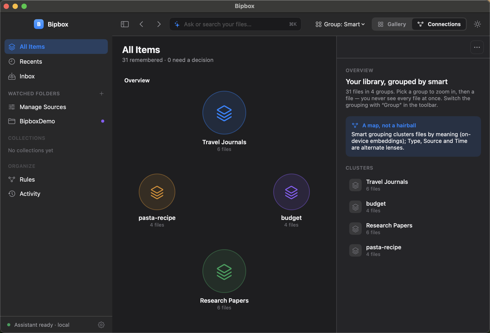
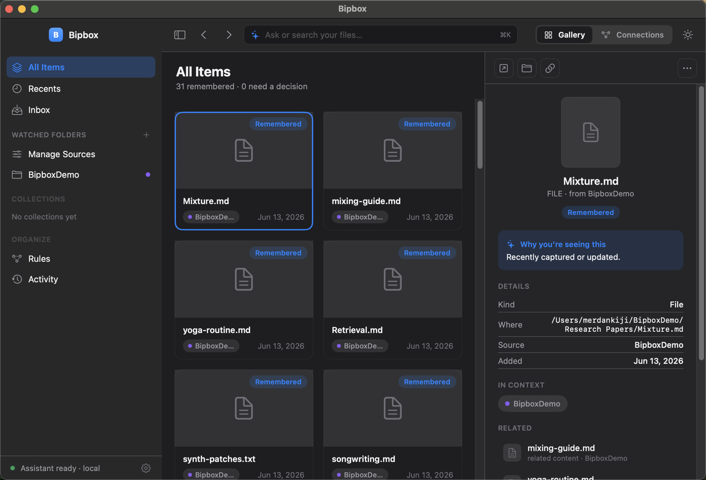
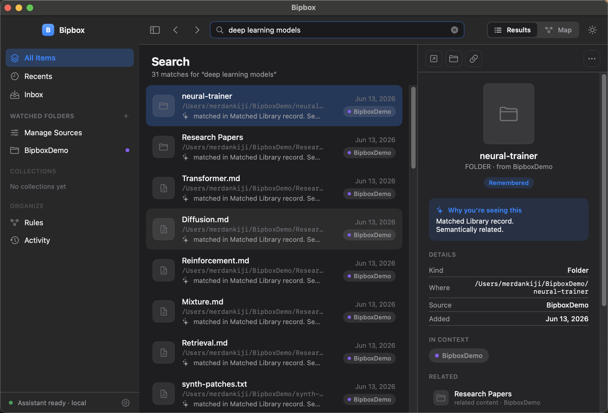

# Bipbox

**A semantic map of your files — built entirely on‑device.**

Bipbox watches the folders you already use (Downloads, Documents, project directories) and turns them into a navigable map grouped *by meaning*, not by location. It indexes file content locally, embeds it with an on‑device model, and clusters everything into topics — so a PDF in `~/Downloads`, a doc in `~/Documents`, and a repo in `~/code` about the same thing land in the same place. No cloud, no uploads, no account.

<p align="center">
  
</p>

---

## Why

File managers organize by *where things are*. Search engines need you to remember *what you called it*. Neither helps when you have thousands of files across years of folders and you only remember roughly what something was *about*.

Bipbox answers four questions about everything you own:

- **What is it about?** — content is extracted and embedded, then grouped into topics.
- **What's related to it?** — nearest‑neighbour links across folders, surfaced as a graph.
- **How do I get it back?** — blended lexical + semantic search.
- **Where did it come from?** — every item keeps its source and history; nothing is moved.

It is **retrieval‑first**: files are indexed in place. Bipbox never moves or renames anything unless you explicitly ask it to.

## Highlights

- **On‑device embeddings** — Qwen3‑Embedding‑0.6B runs in‑process via [MLX](https://github.com/ml-explore/mlx-swift). The model is downloaded once, with your explicit consent; after that everything is offline and private.
- **Semantic topic graph** — mean‑centred embeddings → cosine kNN → Louvain community detection → soft, *overlapping* topic membership. A file can belong to more than one topic; a repo isn't forced into a single bucket.
- **A real node model** — a folder with a project marker (`.git`, `package.json`, `Package.swift`, …) is treated as **one unit**; a content folder collapses into **one collection** whose files stay individually searchable; build junk (`node_modules`, `.build`, …) is pruned. Exact duplicates are detected by a name‑independent byte fingerprint.
- **Cross‑folder by design** — clustering sees only vectors, never paths, so related files group together no matter where they live.
- **Incremental & honest** — re‑scans skip unchanged files via content fingerprints; long operations show a live progress line with an ETA; missing files are flagged and recoverable.
- **Multilingual** — the embedding model is cross‑lingual, so an English note and a Japanese document on the same subject cluster together.

## Screenshots

| Library | Semantic search |
|---|---|
|  |  |

The **library** shows everything indexed in place, with an inspector surfacing each item's source, context and related files. **Search** blends keyword and meaning — querying *"deep learning models"* surfaces a training repo and a research‑paper collection that never contain that exact phrase.

## How it works

```
folder ─▶ descend & classify ─▶ extract text ─▶ embed (MLX) ─▶ vector index
            (projects /            (PDF/OCR/        (on‑device)        │
             collections /          source/doc)                        ▼
             loose files)                              topic discovery (Louvain)
                                                                       │
                                                                       ▼
                                                       graph · search · clusters
```

1. **Descend & classify** — `FilesystemDescender` walks each watched root and decides, per directory, whether it's a project (one unit, stop), a collection (one topic node + indexed members), a bundle (opaque), or a container to descend into.
2. **Extract** — source code is read directly; PDFs (PDFKit), Office/RTF/HTML documents (system importers) and images (Vision OCR) go through a content extractor.
3. **Embed** — name + content is embedded on‑device; duplicates and metadata‑only files are skipped.
4. **Discover topics** — discovery runs over aggregate units and a capped sample of collection members, then *every* item is soft‑assigned to the resulting topics. This "discover from aggregates, assign everyone" rule is what stops a 7,000‑file dump from shattering the graph into noise.
5. **Browse** — the result is the topic graph, blended search, and an item‑level ego graph of neighbours.

The algorithm was validated against a Python research harness on real disks before being ported 1:1 to Swift; the Swift port reproduces the reference clustering exactly.

## Architecture

Hexagonal, Swift 6, Swift Package Manager. The domain core has no platform dependencies — OS and model capabilities enter through protocol ports.

| Module | Role |
|---|---|
| `BipboxCore` | Dependency‑free domain: ports + topic discovery, descent model, extraction, retrieval, knowledge graph |
| `BipboxPersistence` | SQLite FTS5 search index, vector index, knowledge store |
| `BipboxMacOSAdapters` | PDFKit / Vision / AppKit extractors, file ops, folder watcher, permissions |
| `BipboxMLX` | In‑process Qwen3 embedder (the only target linking MLX) |
| `BipboxAI` | LLM orchestration (ships offline‑only defaults) |
| `BipboxAppSupport` | Composition root — `BipboxAppServices.makeDefault()` |
| `BipboxWorkspaceUI` | SwiftUI workspace: library, semantic graph, inspector, settings |
| `BipboxApp` | macOS app shell + model‑provisioning UX |

Architecture diagrams live under [`.omm/`](.omm/).

## Build & run

Requirements: macOS 14+, full Xcode (not just Command Line Tools), and [xcodegen](https://github.com/yonaskolb/XcodeGen) (`brew install xcodegen`).

```bash
# Build a runnable Bipbox.app (Xcode build — bundles MLX's Metal library)
scripts/build_app_bundle.sh
open .build/xcode/Build/Products/Debug/Bipbox.app
```

On first launch the app offers to download the embedding model (~600 MB, once). Until then it's fully usable for indexing and keyword search; the semantic graph fills in after the model is ready.

> **Note:** `swift run` won't work for the GUI — MLX's Metal library only resolves inside an Xcode‑built bundle. Use the build script. Everything *headless* (the whole test suite) runs fine under plain SwiftPM.

## Testing

```bash
swift test          # 405 headless tests (domain, persistence, pipeline, clustering)
scripts/ui-test.sh  # 23 XCUITests driving the real app window
```

## Status

The semantic engine, on‑device embeddings, incremental indexing, schema migration, and progress reporting are complete and tested. Remaining work before a public release is packaging: release signing + notarization, app icon and identity. Backlog: a multimodal image‑embedding lane.

## Privacy

Everything runs locally. File content, embeddings, and the index never leave your machine. The only network access is the one‑time model download from Hugging Face, which you trigger explicitly.
